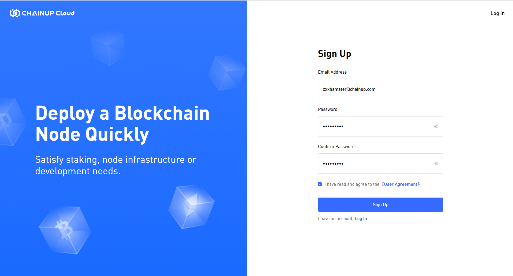
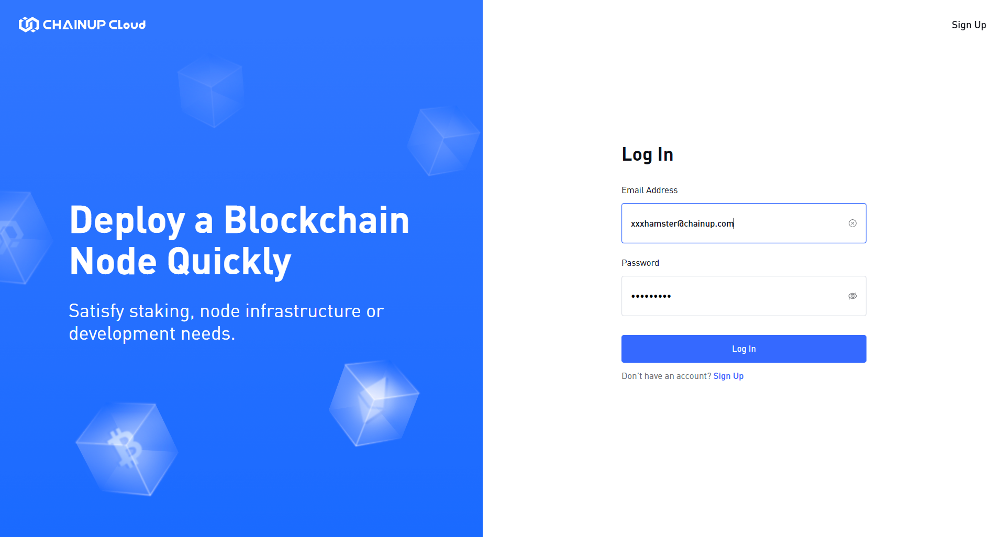
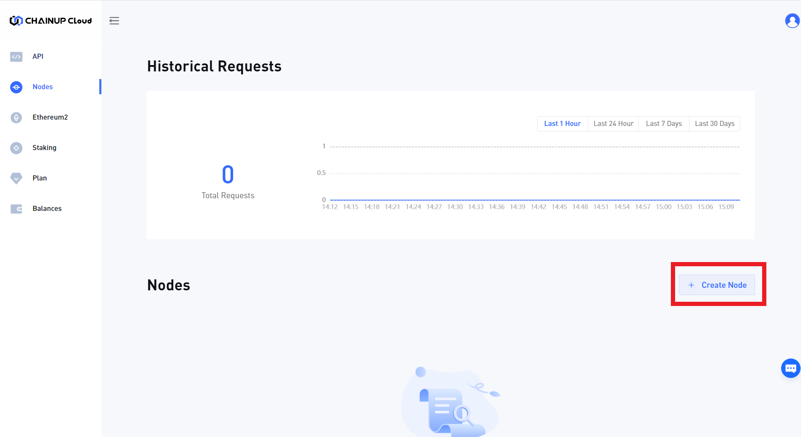
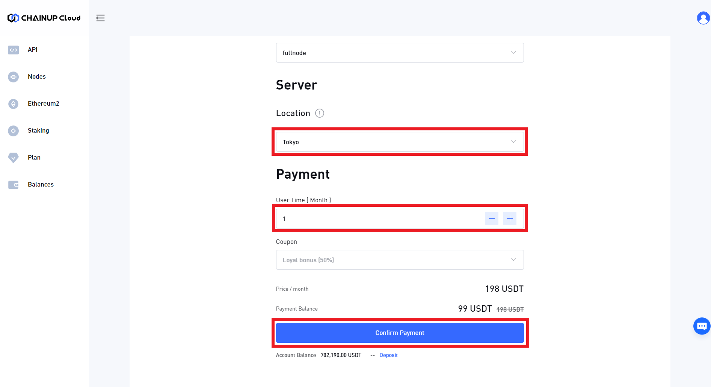
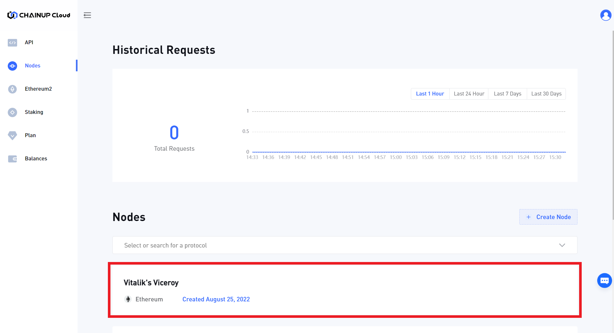

# ⚒ Deploy Dedicated Node

### 1. Creating an Account

**Step 1:** Users are able to sign up on [**ChainUp Cloud**](https://app.chainupcloud.com/register).

**Step 2:** Login to [**ChainUp Cloud**](https://app.chainupcloud.com/login) with your newly created account.

### 2. User Dashboard

**Step 1:** Once you have logged in to [**ChainUp Cloud**](https://app.chainupcloud.com/api), you will need to create a new node and select the blockchain.

<figure><figcaption>
Create Node
</figcaption></figure>

**Step 2:** Now, type in the name of your node, and select the Blockchain, Network and Node Type.

<figure><figcaption>
Select node options
</figcaption></figure>

**Step 3:** Next, select the Node's Location (ideally based on your user's geographic locations), the duration of operation (you can always top up later to extend the duration) and proceed to make a payment

<figure><figcaption>
Making payment
</figcaption></figure>

**Step 4:** Lastly, wait for your node to be ready and you can use it in a similar fashion as the [Blockchain API](use-blockchain-api.md)!

<figure><figcaption>
Node is ready!
</figcaption></figure>

[**Sign up now**](https://app.chainupcloud.com/register) to start building in seconds and discover the wonders of ChainUp Cloud!
