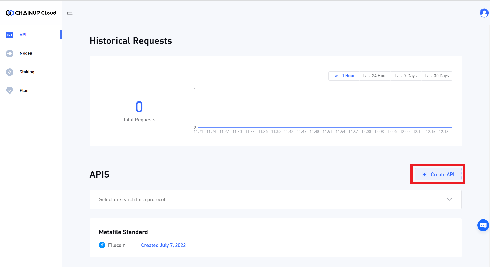
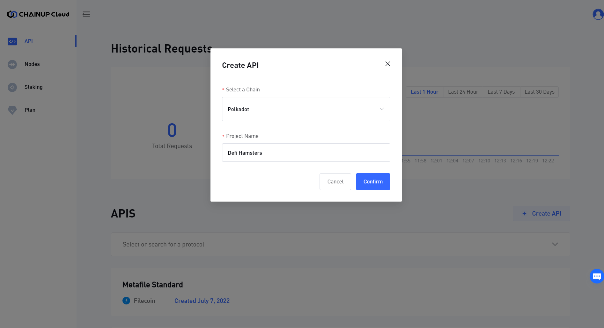
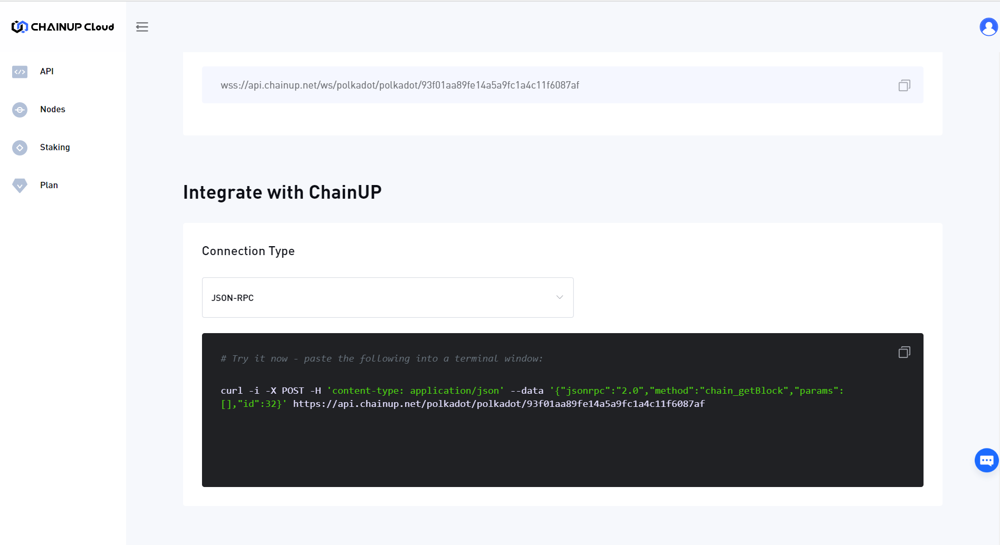
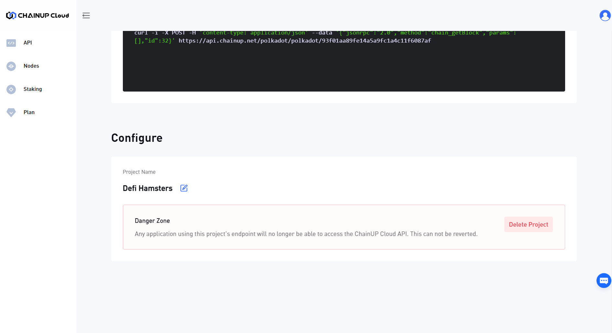
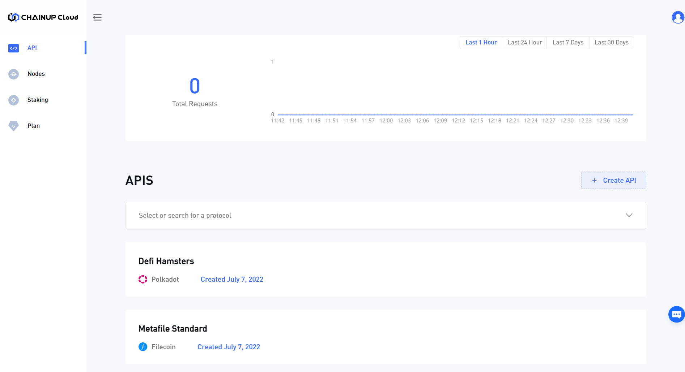

# ⛓ Use Blockchain API

### 1. Creating an Account

**Step 1:** Users are able to sign up on [**ChainUp Cloud**](https://app.chainupcloud.com/register).


**Step 2:** Login to [**ChainUp Cloud**](https://app.chainupcloud.com/login) with your newly created account.


### 2. User Dashboard

**Step 1:** Once you have logged in to [**ChainUp Cloud**](https://app.chainupcloud.com/api), you will need to create a new API key and select the blockchain.



**Step 2:** Now, type in the name of your API and select the blockchain.



**Step 3:** After creating the API, you will get access to the API key under the Project's API Panel, where you can view, copy, create and delete your API keys. You can also view other statistics on the API usage.

.PNG>)

**Step 4:** You can also scroll down to get more info regarding the integration.



**Step 5:** You can scroll further down to configure the settings of the API.



**Step 6:** You can return the dashboard API panel to have an overview of all your APIs.



### 3. Accessing the Blockchain

In this example, we’ll access the Polkadot Blockchain -

**Step 1:** When scrolling down to the integration section, you will be provided with the URL for this service.


**Step 2:** Depending on your setup, there are several ways to use your API key. You can either use the JSON-RPC, WebSocket and more. Here is an example curl:

```
curl -i -X POST  -H 'content-type: application/json' --data '{"jsonrpc":"2.0","method":"chain_getBlock","params":[],"id":32}'  https://api.chainup.net/polkadot/polkadot/93f01aa89fe14a5a9fc1a4c11f6087af
```

Or you can use WebSocket to connect:

```
wscat -c  wss://api.chainup.net/ws/polkadot/polkadot/93f01aa89fe14a5a9fc1a4c11f6087af
```

****[**Sign up now**](https://app.chainupcloud.com/register) to start building in seconds and discover the wonders of ChainUp Cloud!
