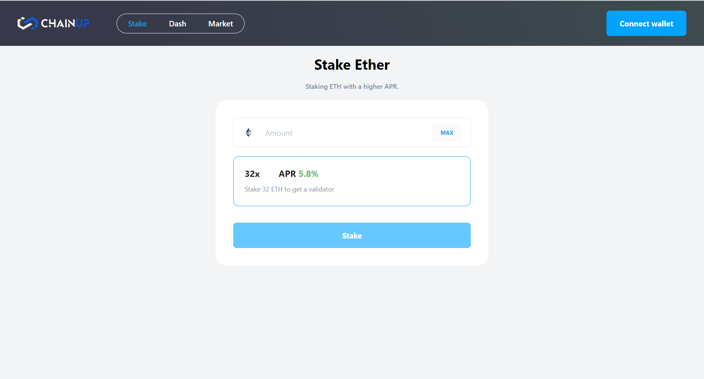
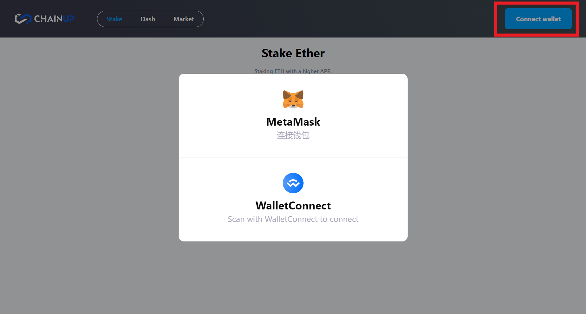
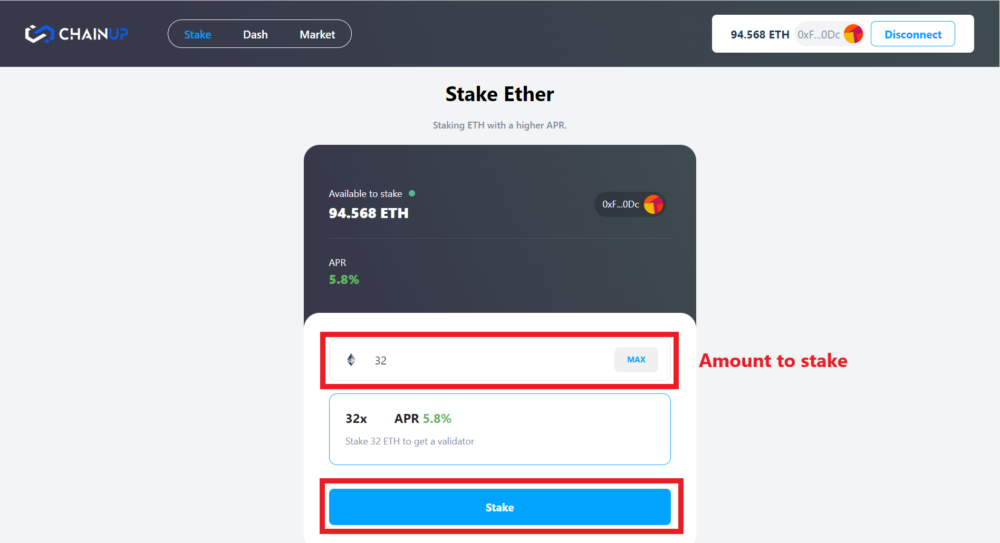
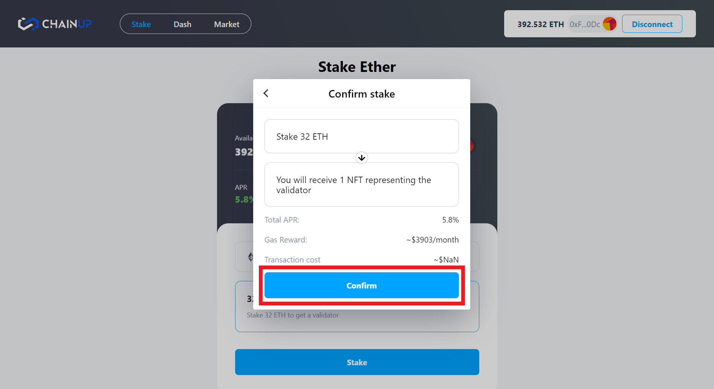
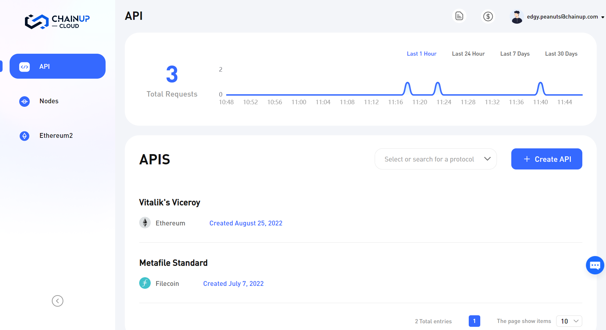

# 🍧 How to use ChainUp Aggregator?

### 1.  Staking using [ChainUp Aggregator](https://staking.chainupcloud.com/)

**Step 1:** [Install a wallet](https://metamask.io/) and have some Eth.

<figure><figcaption>
Metamask is a popular wallet
</figcaption></figure>

**Step 2:** [Visit ChainUp Aggregator page](https://staking.chainupcloud.com/).

<figure><figcaption>
ChainUp Aggregator 
</figcaption></figure>

**Step 3:** Connect your wallet by clicking the **Connect wallet** button.

<figure><figcaption>
Connecting your wallet
</figcaption></figure>

**Step 4:** Input how much you want to stake and click stake! In this example we chose the **32x** strategy to get a real validator node which is represented using a NFT!

<figure><figcaption>
Staking through ChainUp aggregator
</figcaption></figure>

**Step 5:** Click confirm to sign the transaction with your wallet.

<figure><figcaption>
Click to confirm to sign your transaction
</figcaption></figure>

**Step 6:** You can view the breakdown of your portfolio on the dashboard, through [ChainUp Cloud's](https://app.chainupcloud.com/eth2.0) main page or on Opensea! :ship:

<figure><figcaption>
Simple dashboard to view statistics
</figcaption></figure>

[Start staking here now!](https://staking.chainupcloud.com/)
