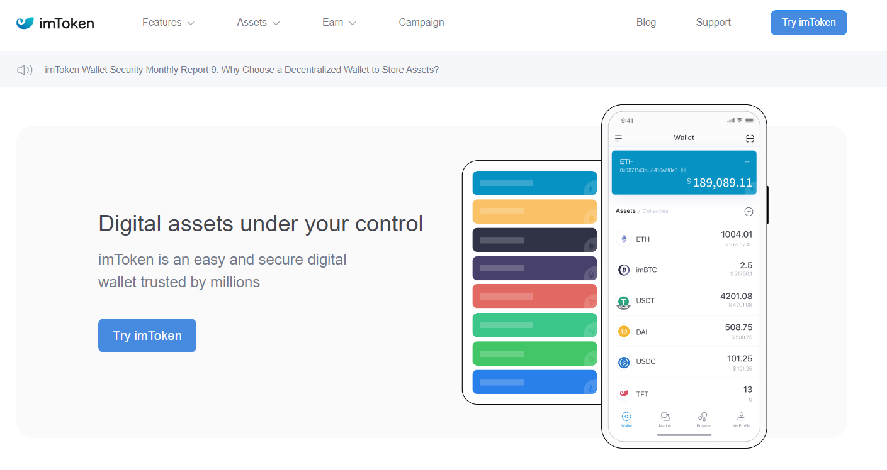
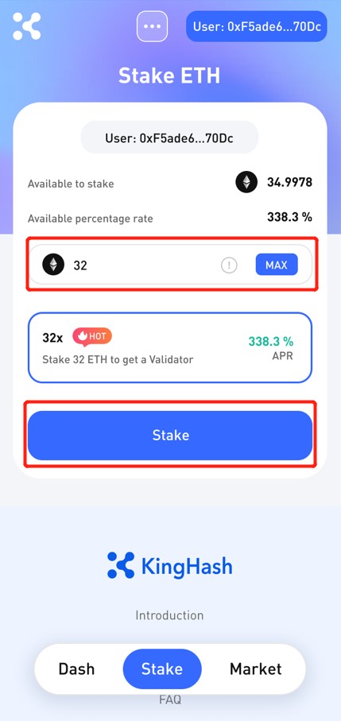
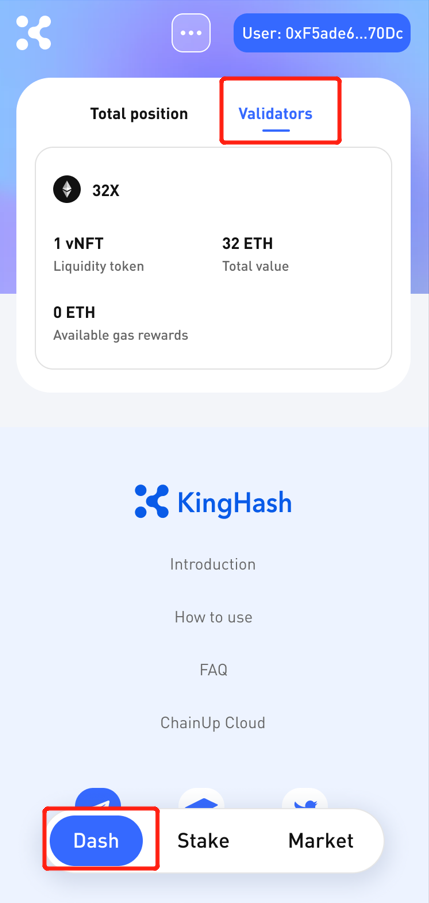

# ⛱ How to use KingHash Aggregator with imToken ?

### 1.  Staking using [KingHash Aggregator](https://www.kinghash.com/)

**Step 1:**  Visit[ imToken](https://token.im/) and download

<figure><figcaption></figcaption></figure>

**Step 2:**  Search KingHash

<figure><figcaption></figcaption></figure>

**Step 3:** Visit KingHash and connect imToken

<figure><figcaption></figcaption></figure>

**Step 4:** Input how much you want to stake and click stake! In this example we chose the **32x** strategy to get a real validator node which is represented using a NFT!

<figure><figcaption></figcaption></figure>

**Step 5:** Upon clicking stake, a wallet (imToken) signature should pop-up for you to sign. This is **NOT A TRANSACTION**, but visual information for you to check. Next, click **Confirm** to sign the transaction with your wallet.

<figure><figcaption></figcaption></figure>

**Step 6:** You can view the breakdown of your portfolio on the dashboard, through our partner's [**ChainUp Cloud's**](https://cloud.chainup.com/app/eth2.0) **** main page or on Opensea! :ship:

<figure><figcaption></figcaption></figure>

****[**Start staking here now!**](https://www.kinghash.com/)****
