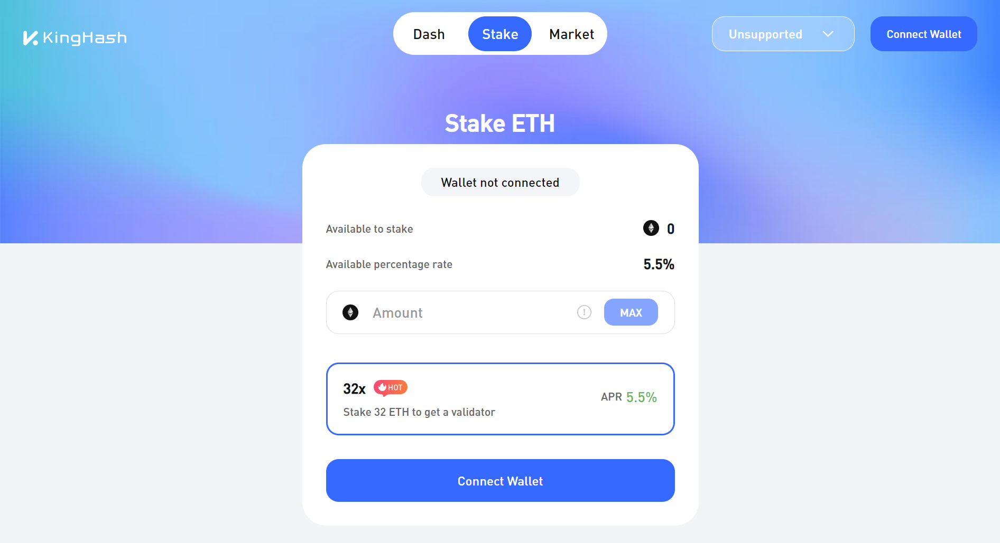
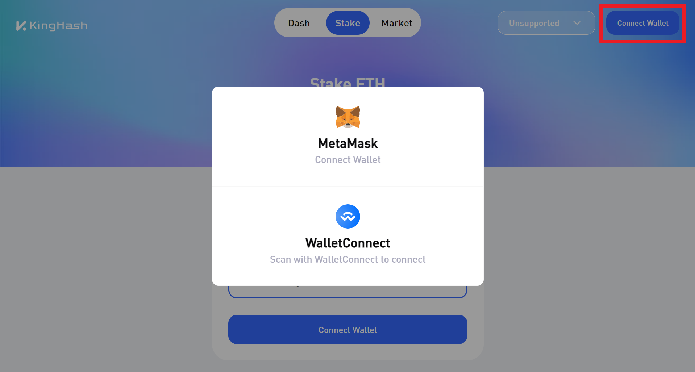
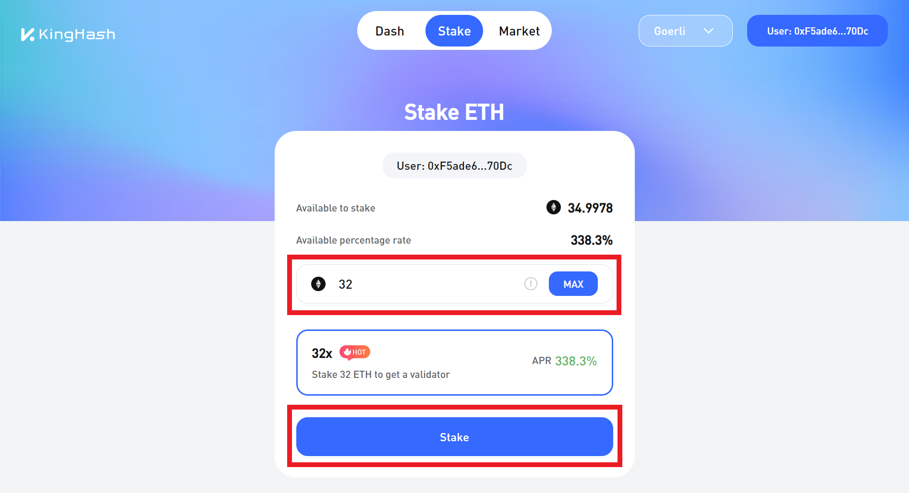
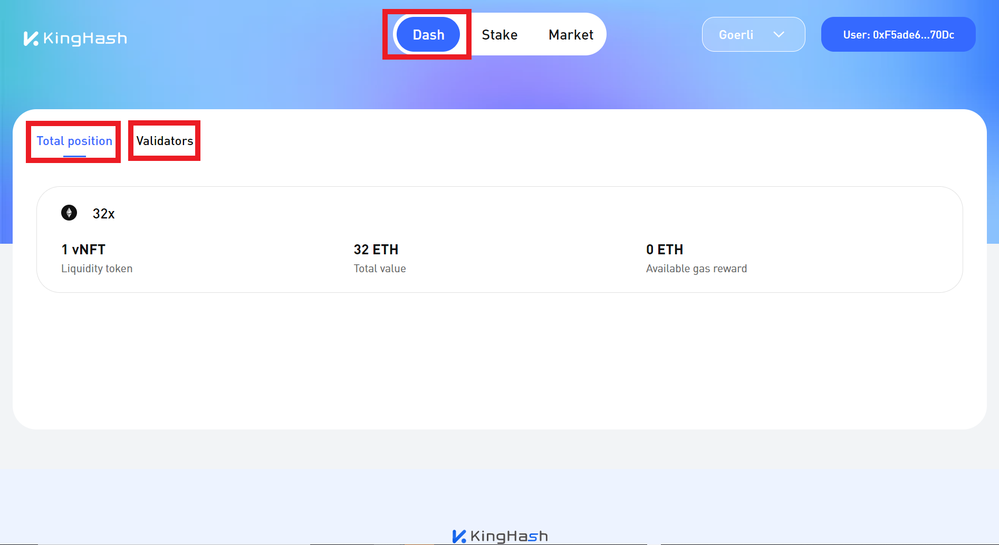

# 🍧 How to use KingHash Aggregator?

### 1.  Staking using [KingHash Aggregator](https://www.kinghash.com/)

**Step 1:** [**Install a wallet**](https://metamask.io/) and have some Eth.

<figure><figcaption>
Metamask is a popular wallet
</figcaption></figure>

**Step 2:** [**Visit KingHash Aggregator page**](https://www.kinghash.com/).

<figure><figcaption>
KingHash Aggregator
</figcaption></figure>

**Step 3:** Connect your wallet by clicking the **Connect wallet** button.

<figure><figcaption>
Connecting your wallet
</figcaption></figure>

**Step 4:** Input how much you want to stake and click stake! In this example we chose the **32x** strategy to get a real validator node which is represented using a NFT!

<figure><figcaption>
Staking through KingHash Aggregator
</figcaption></figure>

**Step 5:** Upon clicking stake, a wallet (Metamask) signature should pop-up for you to sign. This is **NOT A TRANSACTION**, but visual information for you to check. Next, click **Confirm** to sign the transaction with your wallet.

<figure><figcaption>
Click <strong>Confirm</strong> to sign your transaction
</figcaption></figure>

**Step 6:** You can view the breakdown of your portfolio on the dashboard, through our partner's [**ChainUp Cloud's**](https://cloud.chainup.com/app/eth2.0) main page or on Opensea! :ship:

<figure><figcaption>
Simple dashboard to view statistics
</figcaption></figure>

[**Start staking here now!**](https://www.kinghash.com/)
