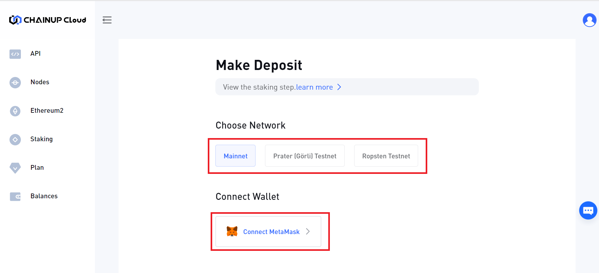
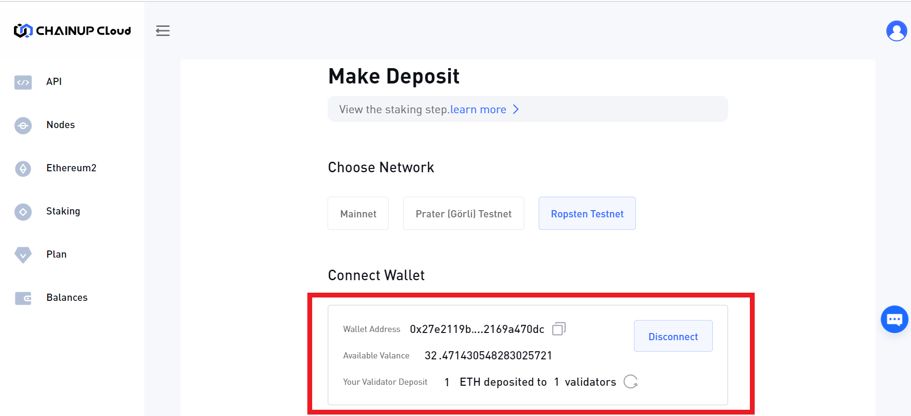
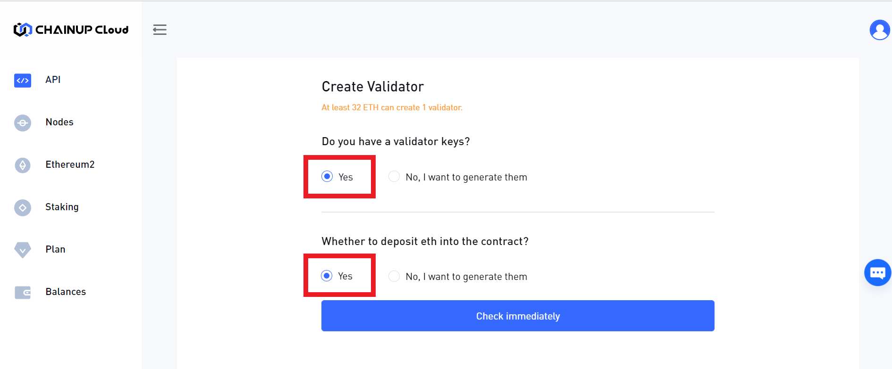
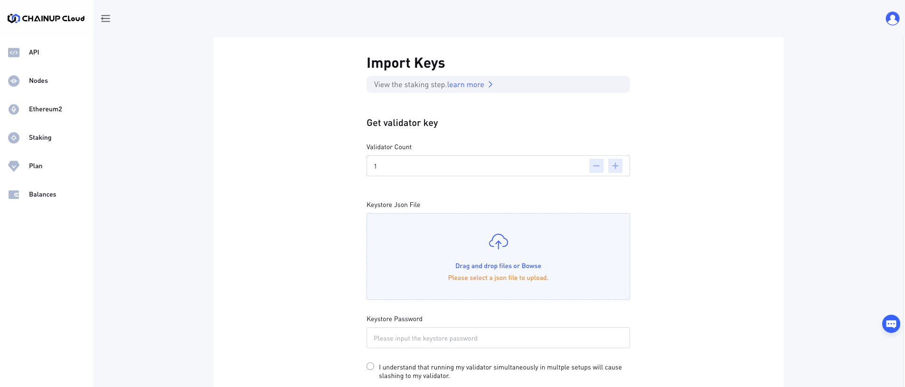
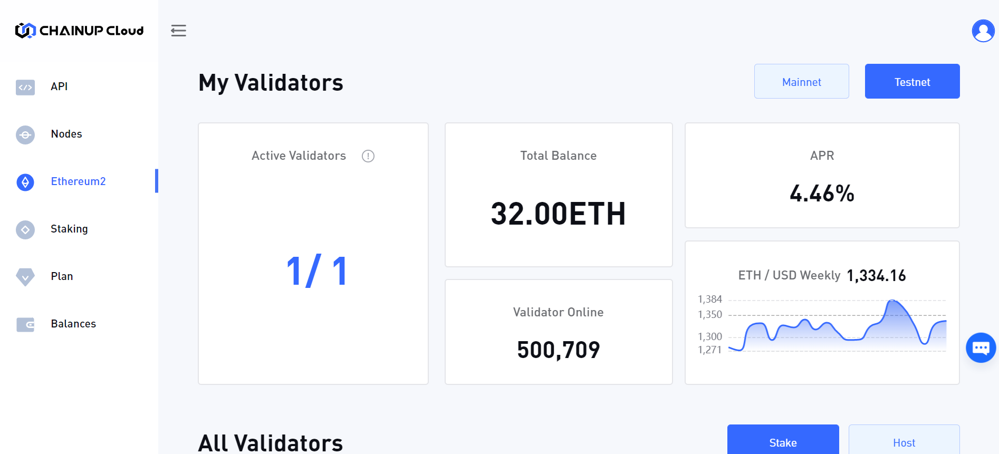

# 👥 Running your own validators

A short guide to start setting up a Ethereum validator with ChainUp Cloud as your node as a service provider.

Prerequisites

a. A compatible wallet(currently only supports Metamask) that holds more than 32 ether

b. Generate Deposit data (deposit\_data-\[timestamp].json) which is through the Ethereum launchpad ([Mainnet](https://launchpad.ethereum.org/en/overview), [Goerli](https://goerli.launchpad.ethereum.org/en/), [Ropsten ](https://ropsten.launchpad.ethereum.org/en/)) and the [deposit-cli tool](https://github.com/ethereum/staking-deposit-cli/releases/).&#x20;

c. Deposit 32 ETH either through Ethereum launchpad ([Mainnet](https://launchpad.ethereum.org/en/overview), [Goerli](https://goerli.launchpad.ethereum.org/en/), [Ropsten ](https://ropsten.launchpad.ethereum.org/en/)) or through the [Abyss Eth2 Depositer](https://abyss.finance/eth2depositor) (which currently supports only Mainnet and Goerli).&#x20;

The following video walkthrough covers prerequisites b and c.&#x20;



Step 1: Login/ Signup

Signup for a free account, for no cost.&#x20;

<figure><figcaption>
Chainup Cloud Platform
</figcaption></figure>

Step 2: Click on Ethereum 2, Make sure, you are in the Ethereum2 subpage, and click on the Host Button

<figure><figcaption></figcaption></figure>

Step 3 - Choose the network you are going to use. &#x20;

Connect your metamask.&#x20;

<figure><figcaption>
Hosting your own nodes- Make Deposit
</figcaption></figure>

Step 4 - If you have deposited 32 eth through the official staking launchpad or abyss eth2 depositor (prerequisites b and c ) , the wallet details will be as shown . &#x20;

<figure><figcaption>
Make Deposit- Check Your Wallet Details
</figcaption></figure>

Step 5 : Check Yes for the following two options.&#x20;

<figure><figcaption></figcaption></figure>

Step 6 -  Import the keys ( deposit_data\__timestamp.json ) - this has been  generated from the deposit-cli tool by following the [video as above](https://www.youtube.com/watch?v=4jpzo9qOaP8\&ab\_channel=ConsenSysMedia).&#x20;

<figure><figcaption>
Import Keys- upload deposit_data.json 
</figcaption></figure>

Step 7 : Done and set! Your validator is now active.&#x20;

<figure><figcaption>
Dashboard showing validator status. 
</figcaption></figure>

**Please note:** after the initial 32 ETH deposit, you may check back after some time or so, as it may take more than 12 hours for a transaction to reach the deposit contract on Beacon Chain.

