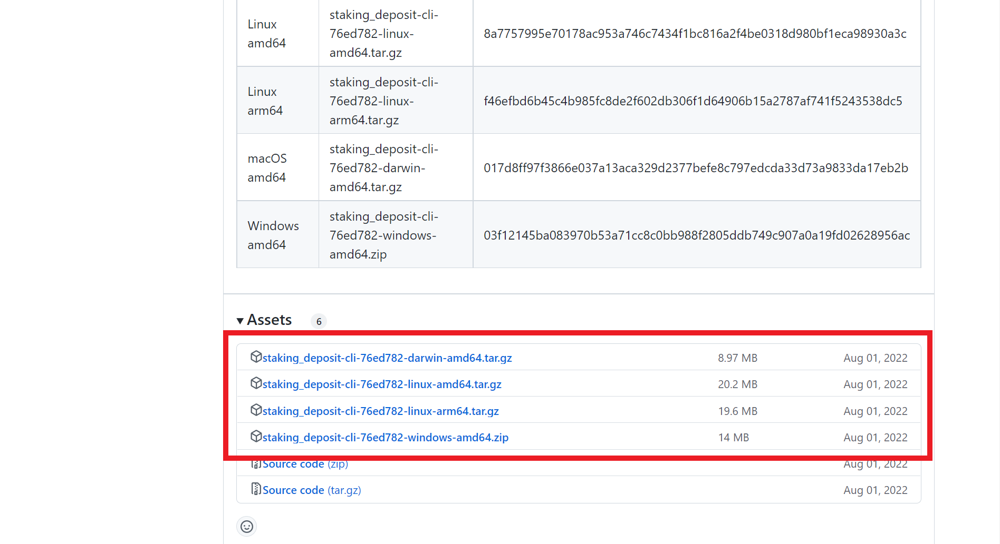
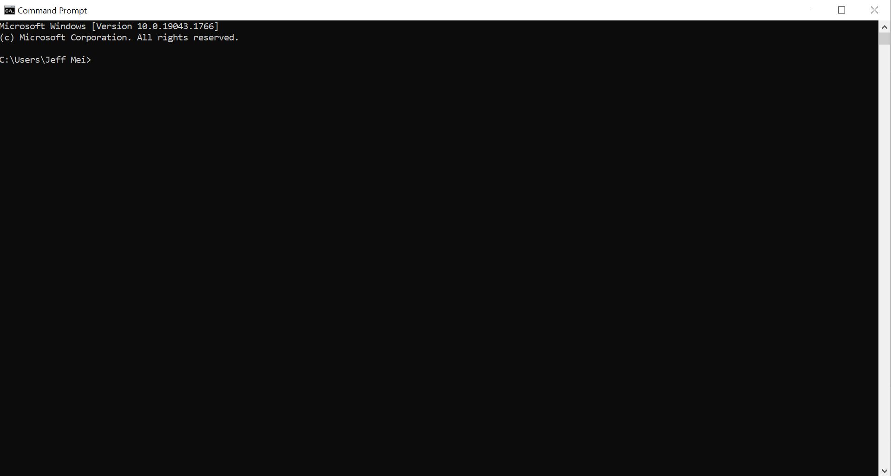
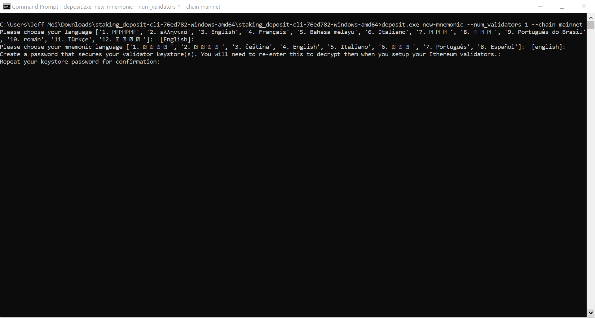
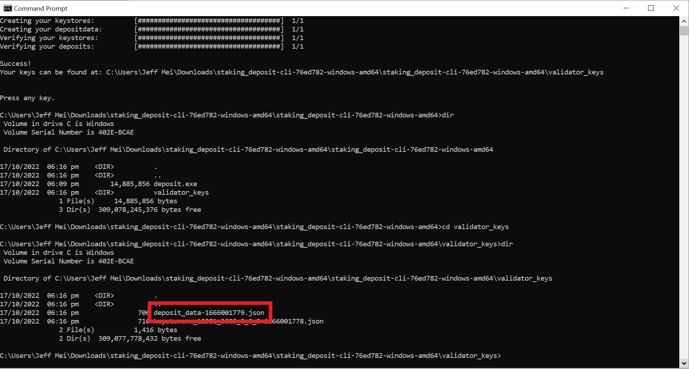
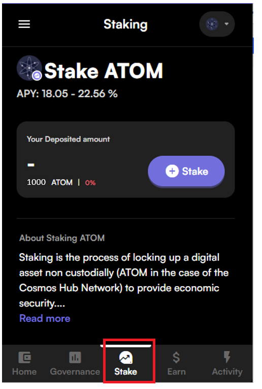
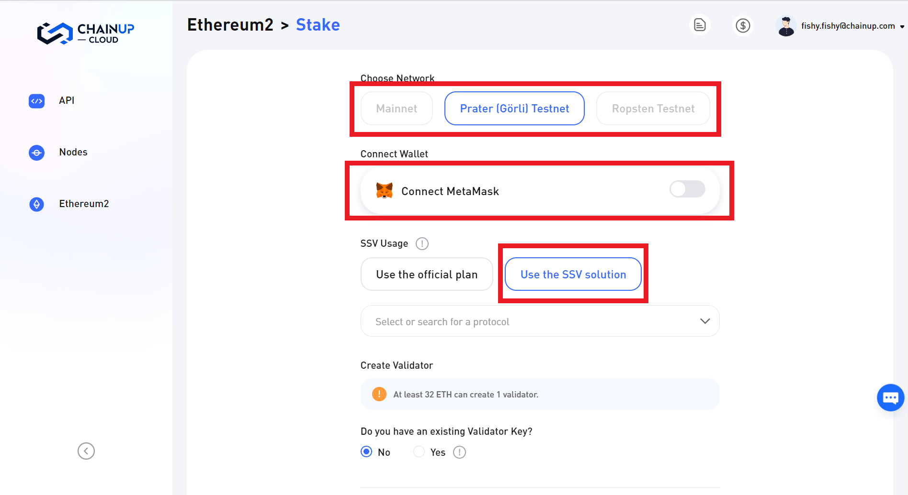
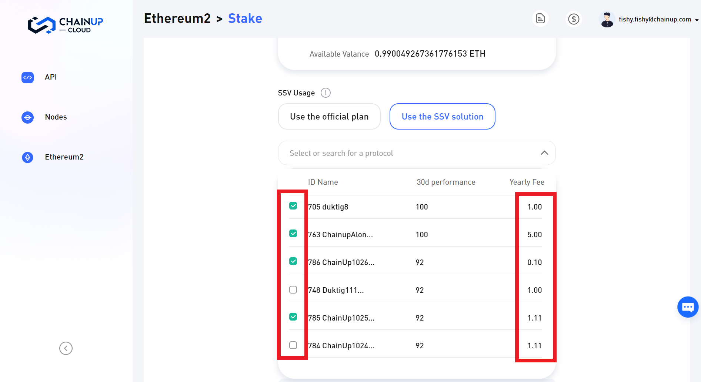
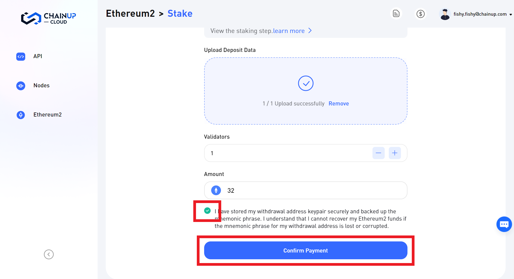

# 🔹 How to stake using SSV?

A short guide to set up staking on Ethereum with [**ChainUp Cloud**](https://cloud.chainup.com/)**,** using the SSV Network.

### **Prerequisites**

**a.** A compatible wallet (currently only supports [**Metamask**](https://metamask.io/)) that holds more than 32 Eth

**b.** Generate `deposit_data-timestamp.json` which can be done through the [**deposit-cli tool**](https://github.com/ethereum/staking-deposit-cli/releases/).&#x20;


Specifically, what we actually need is the `withdrawal_credentials` within the `deposit_data-timestamp.json`


### 1. Generating `deposit_data`/`withdrawal_credentials`

**Step 1:** Download the deposit CLI app [**here**](https://github.com/ethereum/staking-deposit-cli/releases/), ensuring you've selected the right one for your operating system.


Please make sure that you are downloading from the Ethereum Foundation's official GitHub account - [https://github.com/ethereum/staking-deposit-cli/releases/](https://github.com/ethereum/staking-deposit-cli/releases/)


<figure><figcaption>
Select the corresponding executable for your operating system
</figcaption></figure>

**Step 2:** Once the download is complete, uncompress the downloaded file.

**Step 3:** Open your command line/terminal.

<figure><figcaption>
Open a terminal
</figcaption></figure>

**Step 4:** navigate (`cd`) to the directory containing the executable **`deposit`** file.&#x20;

<figure><figcaption>
<code>cd</code> to the directory containing the executable
</figcaption></figure>

**Step 5:** Run the executable with the following command `deposit.exe new-mnemonic --num_validators 1 --chain mainnet` for Windows and `./deposit new-mnemonic --num_validators 1 --chain mainnet` for Linux or MacOS.

<figure><figcaption>
Generate keys &#x26; <code>deposit_data</code>
</figcaption></figure>

**Step 6:** <mark style="color:red;">Please note down the mnemonic phrase</mark> and locate the `deposit_data` file

<figure><figcaption>
<code>deposit_data</code> file will be uploaded to ChainUp Cloud later
</figcaption></figure>


You can find alternative key generating tools [here](https://ethereum.org/en/staking/solo/#key-generators) recommended by the Ethereum foundation.


### 2. Uploading `deposit_data`/`withdrawal_credentials`

**Step 1:** Click on **Ethereum 2** (sidebar). Make sure, you are in the **Ethereum2** subpage, and click on the **Stake Button**.

<figure><figcaption>
Eth2 Validator Dashboard
</figcaption></figure>

**Step 2:** Choose the network you are going to use, connect your [**Metamask**](https://metamask.io/) wallet and select the SSV option.

<figure><figcaption>
Selecting the options
</figcaption></figure>

**Step 3:** Select the SSV operators you want to use.&#x20;

<figure><figcaption>
The fees of each operator (in SSV tokens) can be seen at the right column
</figcaption></figure>


Currently, the SSV Network only supports the selection of 4 SSV operators


**Step 4:**  Upload/Import the deposit data (`deposit_data.json`) - this has been generated from the `deposit-cli` tool earlier.

<figure><figcaption>
Upload deposit data
</figcaption></figure>

**Step 5:** Click **Confirm Payment** and a series of transaction should appear for you to confirm. Do remember to store your mnemonic phrase safely!

<figure><figcaption>
Confirm payment
</figcaption></figure>

**Step 6:** Await the transaction to be confirmed on-chain, and that's all! Your Eth is now staked and earning yield! :fire:


Do note that the fee charged is a yearly payment, you should top-up your SSV tokens if you wish to stake for a period longer than a year.


[**Sign up now**](https://cloud.chainup.com/app/register) to start staking and discover the wonders of ChainUp Cloud!


**Random Fact:** Founded in 2017 and headquartered in Singapore, ChainUp is a leader in blockchain technology and crypto ecosystem solutions.

