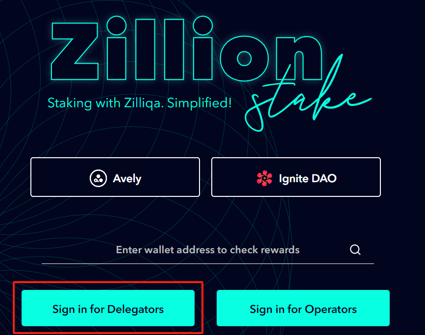
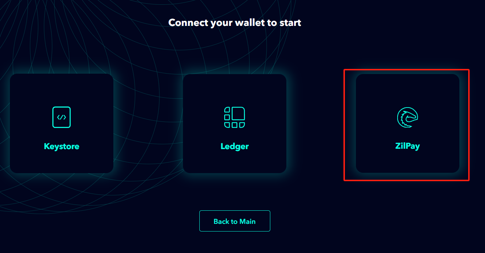
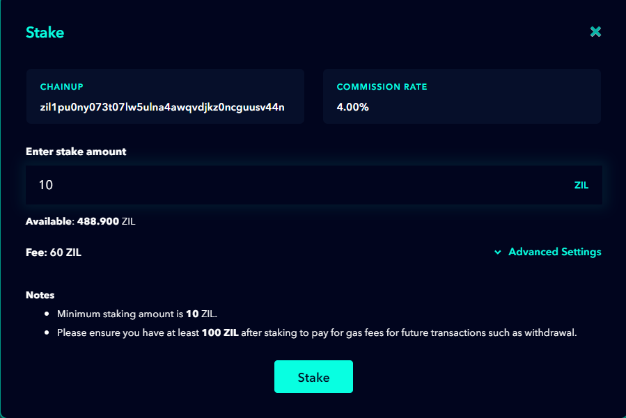
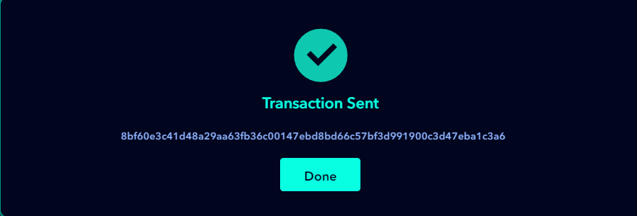

# 🕶 Staking on ZILLIQA

### 1. Install the ailpay wallet

* install zilliqa wallet [https://zilpay.io/](https://zilpay.io/)

<figure><figcaption></figcaption></figure>

* Create a wallet, withdraw Zilliqa token to the wallet.

### **2. Initiate staking**

* Open the node selection website. [https://stake.zilliqa.com/](https://stake.zilliqa.com/)&#x20;
* clink sign in for delegators

<figure><figcaption></figcaption></figure>

* Connect the ZilliqaPay wallet.

<figure><figcaption></figcaption></figure>

* Select the ChainUp node and click on "Stake."

<figure><figcaption></figcaption></figure>

* Enter the amount you want to stake and click "Stake."
* Complete the staking process in the wallet.

<figure><figcaption></figcaption></figure>

