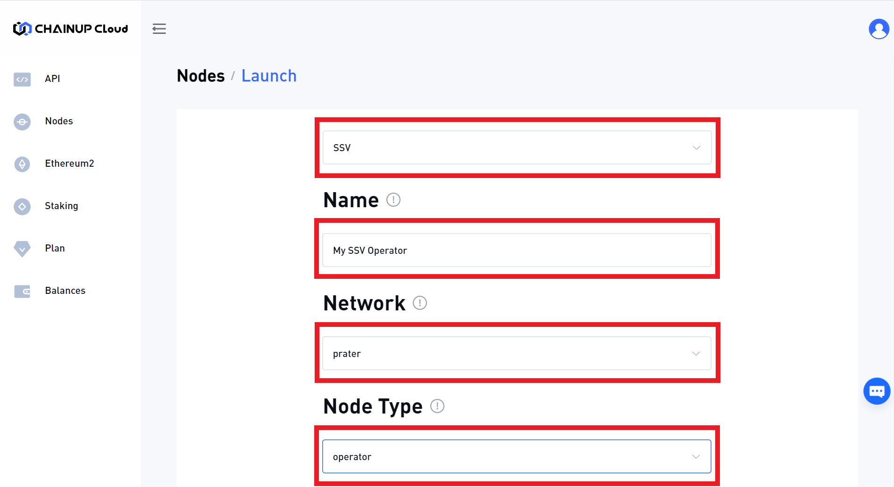
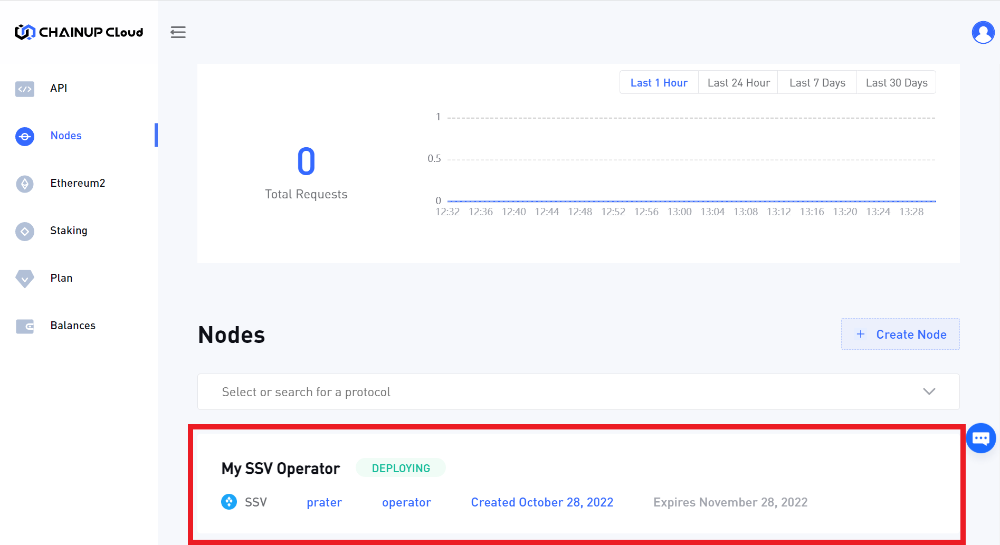
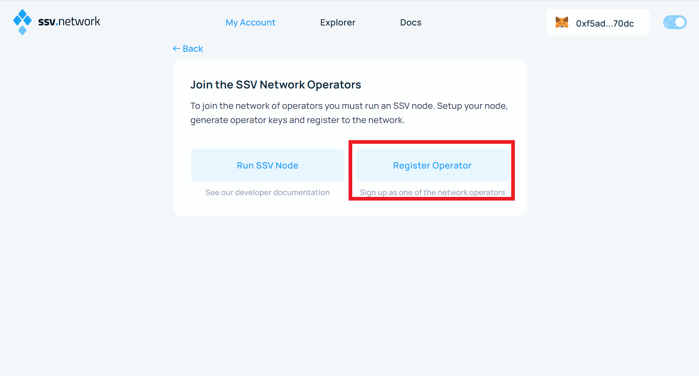
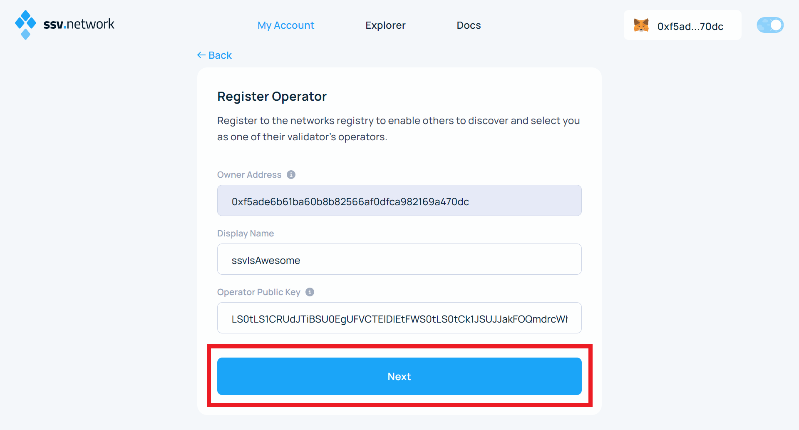
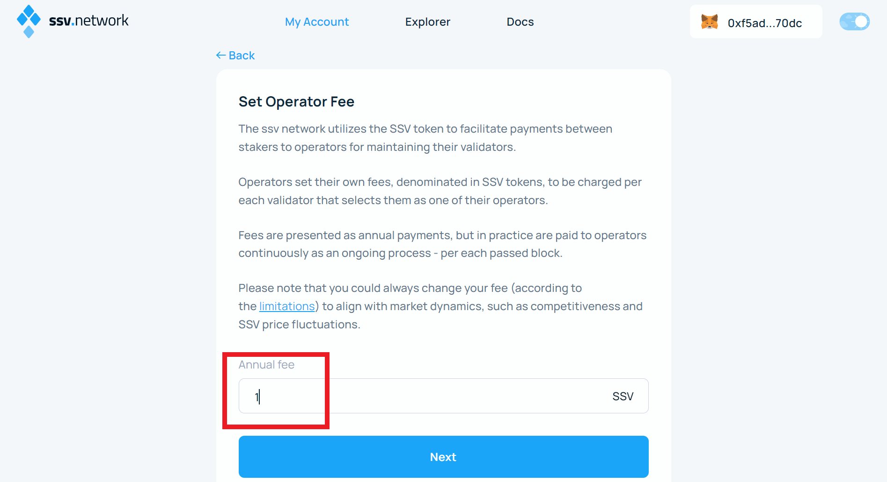
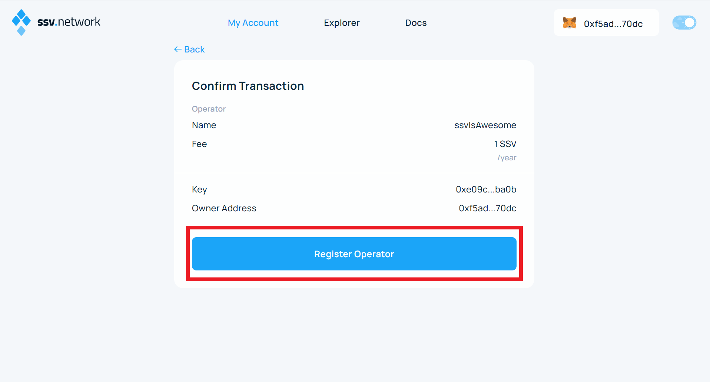

# Running Operator Node

A short guide to set up a SSV Operator with [**ChainUp Cloud**](https://cloud.chainup.com/) as a service provider. SSV (ssv.network) is a fully decentralized, open-source ETH staking network, based on Secret Shared Validator (SSV) technology. It provides an open and simple infrastructure for splitting and distributing a validator key into multiple KeyShares, for the purpose of running an Ethereum validator across multiple non-trusting nodes.

### 1. Creating an Account

**Step 1:** Users are able to sign up on [**ChainUp Cloud**](https://cloud.chainup.com/app/register).

**Step 2:** Login to [**ChainUp Cloud**](https://cloud.chainup.com/app/login) with your newly created account.

### 2. User Dashboard

**Step 1:** Once you have logged in to [**ChainUp Cloud**](https://cloud.chainup.com/app/nodes), you will need to create a new node and select the blockchain.

<figure><figcaption>
Create Node
</figcaption></figure>

**Step 2:** Now, type in the name of your node, and select the Blockchain, Network and Node Type. For the case of SSV, select the SSV node type.

<figure><figcaption>
Select a node
</figcaption></figure>

**Step 3:** Next, select the Node's Location (ideally based on your user's geographic locations), the duration of operation (you can always top up later to extend the duration) and proceed to make a payment

<figure><figcaption>
Making payment
</figcaption></figure>

**Step 4:** Return to the dashboard and click the SSV node to configure the SSV operator.

<figure><figcaption>
View SSV node
</figcaption></figure>

**Step 5:** Copy the public key and open the SSV application.

<figure><figcaption>
Open the SSV web application
</figcaption></figure>

**Step 6:** Connect your wallet and click **Register Operator**.

<figure><figcaption>
Register
</figcaption></figure>

**Step 7:** Fill in the Operator details.

<figure><figcaption>
Fill in Operator Details
</figcaption></figure>

**Step 8:** Set the amount of fee you want to charge the users for your operator.

<figure><figcaption>
Set fee
</figcaption></figure>

**Step 9:** Lastly, register the operator by signing the transaction, and you are done! :smile:

<figure><figcaption>
Register operator
</figcaption></figure>

[**Sign up now**](https://cloud.chainup.com/app/register) to start building in seconds and discover the wonders of ChainUp Cloud!
